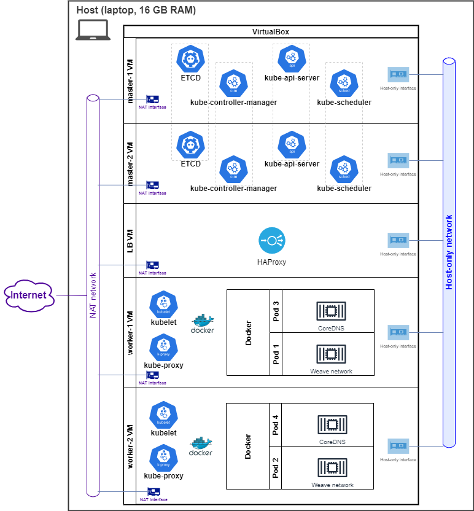

> This tutorial is a modified version of the original developed by [Mumshad Mannambeth](https://github.com/mmumshad/kubernetes-the-hard-way) who started from [Kelsey Hightower](https://github.com/kelseyhightower/kubernetes-the-hard-way) repository.

# Kubernetes The Hard Way On VirtualBox

This tutorial walks you through setting up Kubernetes the hard way on a local machine using VirtualBox and Vagrant.
This guide is not for people looking for a fully automated command to bring up a Kubernetes cluster, however, the automation is provided: [Lab Automation](./docs/16-lab-automation.md).

If you prefer public cloud, you can use another tutorial prepared by me to be run on Azure Cloud: [K8s hard way on Azure](https://github.com/Marcin-Blazowski/k8s-hardway-azure).

There are, for sure, better ways to build the cluster. Please check out [Google Kubernetes Engine](https://cloud.google.com/kubernetes-engine), or the [Getting Started Guides](http://kubernetes.io/docs/getting-started-guides/).

### Kubernetes The Hard Way is optimized for learning, which means taking the long route to ensure you understand each task required to bootstrap a Kubernetes cluster.

##### If you come into problems while moving through labs you can provision the whole environment with k8s cluster up and running as described in [Lab Automation](./docs/16-lab-automation.md) or try to use automation scripts mentioned in Vagrantfile.auto.

This tutorial is a modified version of the original developed by  by [Mumshad Mannambeth](https://github.com/mmumshad/kubernetes-the-hard-way) who started from [Kelsey Hightower](https://github.com/kelseyhightower/kubernetes-the-hard-way) repository.

While the original one has some k8s components' versions hardcoded this one tries to use the latest version if possible.
Most of other differences are listed here: [Differences](./docs/differences-to-original.md).

> The results of this tutorial should not be viewed as production ready, and may receive limited support from the community, but don't let that stop you from learning!

## Target Audience

The target audience for this tutorial is someone planning to support a production Kubernetes cluster and wants to understand how everything fits together.

## Cluster Details

Kubernetes The Hard Way guides you through bootstrapping a highly available Kubernetes cluster with end-to-end encryption between components and RBAC authentication.

* [Ubuntu](https://ubuntu.com/) 18.04, tested with v20220213.0.0 of the Vagrant/Virtualbox "image"
* [Kubernetes](https://github.com/kubernetes/kubernetes) latest version (tested with 1.23.4)
* [Docker](https://docs.docker.com) latest version (by https://get.docker.com, tested with 20.10.12)
* [CNI Container Networking](https://github.com/containernetworking/cni) latest version (tested with 1.0.1)
* [Weave Networking](https://www.weave.works/docs/net/latest/kubernetes/kube-addon/)
* [etcd](https://github.com/coreos/etcd) latest version (tested with v3.5.2)
* [CoreDNS](https://github.com/coredns/coredns) latest (tested with v1.9.0)

## Architecture Overview

## Labs

* [Prerequisites](docs/01-prerequisites.md)
* [Provisioning Compute Resources](docs/02-compute-resources.md)
* [Installing the Client Tools](docs/03-client-tools.md)
* [Provisioning the CA and Generating TLS Certificates](docs/04-certificate-authority.md)
* [Generating Kubernetes Configuration Files for Authentication](docs/05-kubernetes-configuration-files.md)
* [Generating the Data Encryption Config and Key](docs/06-data-encryption-keys.md)
* [Bootstrapping the etcd Cluster](docs/07-bootstrapping-etcd.md)
* [Bootstrapping the Kubernetes Control Plane](docs/08-bootstrapping-kubernetes-controllers.md)
* [Bootstrapping the Kubernetes Worker Nodes](docs/09-bootstrapping-kubernetes-workers.md)
* [TLS Bootstrapping the Kubernetes Worker Nodes](docs/10-tls-bootstrapping-kubernetes-workers.md)
* [Configuring kubectl for Remote Access](docs/11-configuring-kubectl.md)
* [Deploy Weave - Pod Networking Solution](docs/12-configure-pod-networking.md)
* [Kube API Server to Kubelet Configuration](docs/13-kube-apiserver-to-kubelet.md)
* [Deploying the DNS Cluster Add-on](docs/14-dns-addon.md)
* [Smoke Test](docs/15-smoke-test.md)
* [Lab Automation](docs/16-lab-automation.md)
* [Extra - Certificate Verification](docs/verify-certificates.md)
